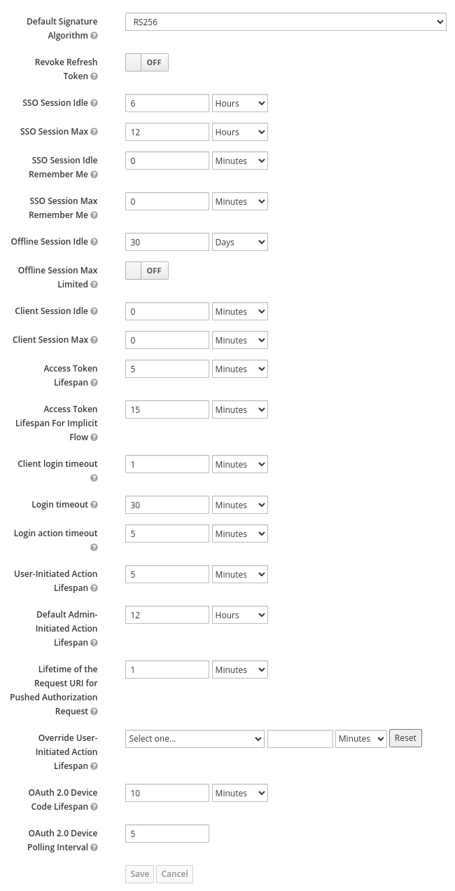

# keycloak

This Ansible role installs [Keycloak](https://github.com/keycloak/keycloak)
(v17+, Quarkus) on an Ubuntu 20.04 LXC container,
with Keycloak configured to be accessed via a reverse proxy
on a different host in the same network.


## Motivation

It has become time to replace `auth0.com` backed by Google Apps with
something else. Reasons `auth0` is no longer viable:

+ auth0.com no longer offers the free plan I originally signed up for, and 
  although it still works it no longer allows adding new users
+ auth0.com authentication having an annoyingly short lifetime, causing
  incessant logouts and sometimes loss of data in forms and such
+ [Google Suite free tier shutting down](https://arstechnica.com/gadgets/2022/01/google-tells-free-g-suite-users-pay-up-or-lose-your-account/)


## Apache virtualhost on the reverse proxy

```
<VirtualHost *:80>
   ServerAdmin webmaster@example.com
   ServerName keycloak.example.com

   Redirect permanent / https://keycloak.example.com/

   ErrorLog ${APACHE_LOG_DIR}/keycloak.example.com_error.log
   CustomLog ${APACHE_LOG_DIR}/keycloak.example.com_access.log combined
</VirtualHost>

<VirtualHost *:443>
   ServerAdmin webmaster@example.com
   ServerName keycloak.example.com

   ProxyPreserveHost On
   ProxyRequests Off
   ProxyPass / http://10.252.116.2:8080/
   ProxyPassReverse / http://10.252.116.2:8080/
   RequestHeader set X-Forwarded-Proto "https"
   RequestHeader set X-Forwarded-For "https"

   SSLEngine on
   SSLCertificateKeyFile   /etc/letsencrypt/live/keycloak.example.com/privkey.pem
   SSLCertificateFile      /etc/letsencrypt/live/keycloak.example.com/cert.pem
   SSLCertificateChainFile /etc/letsencrypt/live/keycloak.example.com/chain.pem
	
   ErrorLog ${APACHE_LOG_DIR}/keycloak.example.com_error.log
   CustomLog ${APACHE_LOG_DIR}/keycloak.example.com_access.log combined
</VirtualHost>
```

## Role dependencies

See `meta/main.yml`.

```
psql_version: 12
db_admin_username: postgres
java_use_ppa: false
java_version: '17'
```


## Notes

The container runs a fresh Ubuntu Focal image, along with 

https://www.keycloak.org/migration/migrating-to-quarkus#_setup_of_initial_users
> To add the initial admin user, set the environment variables `KEYCLOAK_ADMIN` 
> and `KEYCLOAK_ADMIN_PASSWORD` for the username and password of the user. 
> Keycloak uses them at the first startup to create an initial user with 
> administration rights.

[Here is an example Ansible task using the deprecated `add-user-keycloak.sh`
function](https://github.com/ansible-middleware/keycloak/blob/e773e12e246fc97b3bab61fb15f713e1350b847d/roles/keycloak/tasks/main.yml). And [another example (simpler)](https://github.com/andrelohmann/ansible-role-keycloak/blob/e559ff0bd790e8cd61a0910146611c44f9ac7dfc/tasks/admin.yml).


I plan to start by simply maintaining a "list" of users/passwords in Keycloak
itself. Furthermore, I want to install Keycloak on its own LXC container
configured as far as possible for production, but without going so far as to
run multiple Keycloak instances with a shared database backend.

> Everytime that configuration gets changed, you need to execute 
> `bin/kc.sh build` to rebuild the server configuration


https://confluence.atlassian.com/jirakb/postgresql-java-sql-sqlexception-no-suitable-driver-found-828780512.html
> Ensure that the PostgreSQL driver is located in [...] in `lib/`:

```
root@muscat:/home/taha
# find /opt/keycloak/lib/ -type f -name "*jdbc*"
/opt/keycloak/lib/lib/main/io.quarkus.quarkus-jdbc-mysql-deployment-2.7.5.Final.jar
/opt/keycloak/lib/lib/main/com.oracle.database.jdbc.ojdbc11-21.4.0.0.jar
/opt/keycloak/lib/lib/main/io.quarkus.quarkus-jdbc-oracle-deployment-2.7.5.Final.jar
/opt/keycloak/lib/lib/main/io.quarkus.quarkus-jdbc-mssql-2.7.5.Final.jar
/opt/keycloak/lib/lib/main/io.quarkus.quarkus-jdbc-oracle-2.7.5.Final.jar
/opt/keycloak/lib/lib/main/io.quarkus.quarkus-jdbc-mariadb-deployment-2.7.5.Final.jar
/opt/keycloak/lib/lib/main/com.microsoft.sqlserver.mssql-jdbc-7.2.2.jre8.jar
/opt/keycloak/lib/lib/main/io.quarkus.quarkus-jdbc-h2-deployment-2.7.5.Final.jar
/opt/keycloak/lib/lib/main/io.quarkus.quarkus-jdbc-postgresql-2.7.5.Final.jar
/opt/keycloak/lib/lib/main/org.mariadb.jdbc.mariadb-java-client-2.7.5.jar
/opt/keycloak/lib/lib/main/io.quarkus.quarkus-jdbc-mssql-deployment-2.7.5.Final.jar
/opt/keycloak/lib/lib/main/io.quarkus.quarkus-jdbc-mysql-2.7.5.Final.jar
/opt/keycloak/lib/lib/main/io.quarkus.quarkus-jdbc-mariadb-2.7.5.Final.jar
/opt/keycloak/lib/lib/main/org.testcontainers.jdbc-1.16.3.jar
/opt/keycloak/lib/lib/main/io.quarkus.quarkus-jdbc-h2-2.7.5.Final.jar
/opt/keycloak/lib/lib/main/org.wildfly.security.wildfly-elytron-realm-jdbc-1.18.3.Final.jar
/opt/keycloak/lib/lib/main/io.quarkus.quarkus-jdbc-postgresql-deployment-2.7.5.Final.jar
```
Well, seems like there is two filenames with both `jdbc` and `postgresql` in `lib/lib/main/`,
so the PostgreSQL drivers are clearly in place.


## Setting up Keycloak server

The master realm should only be used by the admin to create other realms.
https://www.keycloak.org/docs/latest/server_admin/

So we should look into how to create realms with Ansible (it might or might not
be worth ansiblifying this step).

How to configure Apache with OIDC with Keycloak (like what I've with auth0)?

+ https://www.keycloak.org/docs/latest/securing_apps/index.html#_mod_auth_openidc
+ https://www.janua.fr/using-apache2-mod_auth_openidc-module-with-keycloak-openid-connect/
+ https://wjw465150.gitbooks.io/keycloak-documentation/content/securing_apps/topics/oidc/mod-auth-openidc.html
+ https://stackoverflow.com/questions/64949839/keycloak-apache-mod-auth-openidc-elasticsearch-opendistro


### Protecting our first application (using Apache `mod_auth_openidc`)

I have created a new realm, and created its first user.

> The `mod_auth_openidc` module functions as an OpenID Connect Relying Party (RP)
> and enables authentication against an OpenID Connect Provider
> [in our case Keycloak].

I think I have managed to put my first webservice behind a Keycloak client.
All of the Apache vhost config was done in the `luxor` playbook.

+ https://github.com/zmartzone/mod_auth_openidc
+ https://www.keycloak.org/docs/latest/securing_apps/
+ https://www.appsdeveloperblog.com/keycloak-client-credentials-grant-example/
+ https://curity.io/resources/learn/apache-mod-auth-openidc/


### Increasing session lifetime (testing)

The default settings are not bad, but I want to make it easier for my users
to pick up where they left off without having to logout/login again.


I have increased `SSO Session Idle` sharply and `SSO Session Max` slightly:


+ https://stackoverflow.com/a/67624190
+ https://github.com/keycloak/keycloak-documentation/blob/main/server_admin/topics/sessions/timeouts.adoc


## Refs

+ https://www.keycloak.org/guides
+ https://www.keycloak.org/server/all-config
+ https://www.soundsessential.com/blog/215-keycloak-17-filemaker-installation-configuration-tutorial-part-4-starting-keycloak-17-next-steps
+ https://github.com/keycloak/keycloak/discussions/10180
+ http://www.mastertheboss.com/keycloak/getting-started-with-keycloak-powered-by-quarkus/
+ https://www.keycloak.org/docs/latest/release_notes/
+ https://jdbc.postgresql.org/documentation/head/connect.html


### Ansible roles
+ https://github.com/ansible-middleware/keycloak
+ https://github.com/andrewrothstein/ansible-keycloak
+ https://github.com/andrelohmann/ansible-role-keycloak
+ https://github.com/zhangran1/ansible-role-keycloak


### Ansible plugins
+ [community.general.keycloak_realm](https://docs.ansible.com/ansible/latest/collections/community/general/keycloak_realm_module.html)
+ [community.general.keycloak_role](https://docs.ansible.com/ansible/latest/collections/community/general/keycloak_role_module.html)
+ [community.general.keycloak_client](https://docs.ansible.com/ansible/latest/collections/community/general/keycloak_client_module.html)
+ [community.general.keycloak_authentication](https://docs.ansible.com/ansible/latest/collections/community/general/keycloak_authentication_module.html)
+ [community.general.keycloak_clienttemplate](https://docs.ansible.com/ansible/latest/collections/community/general/keycloak_clienttemplate_module.html)
+ [community.general.keycloak_client_rolemapping](https://docs.ansible.com/ansible/latest/collections/community/general/keycloak_client_rolemapping_module.html)
